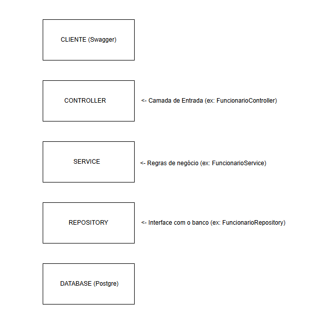
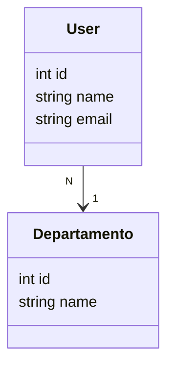

## 🧱 Arquitetura do Projeto

API Bradesco - Funcionário.

Olá! 👋.

Essa é uma API RESTful que desenvolvi para gerenciar o vínculo entre funcionários e seus departamentos.

Funcionalidades
CRUD completo de funcionários e departamentos.

Utilização dos verbos HTTP adequados para cada operação.

Banco de dados H2 no perfil de desenvolvimento (DEV).

PostgreSQL no perfil de produção (PRD).

Lombok para reduzir boilerplate no código.

Testes unitários implementados.

Dados mockados via arquivo import.sql .

Diagrama da estrutura do banco feito com Mermaid (veja abaixo).

API hospedada na nuvem Railway, com URL pública disponível.

Você pode acessar a documentação Swagger da API no link abaixo:

(https://api-bradesco-funcionario-production-rodrigo.up.railway.app/swagger-ui/index.html)

