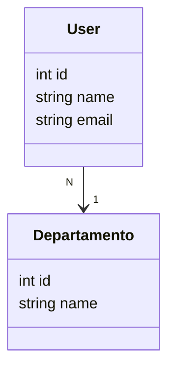

# api-bradesco-funcionario

```mermaid

classDiagram
    class User {
        int id
        string name
        string email
    }

    class Departamento {
        int id
        string name
    }

    User "N" --> "1" Departamento 

```
